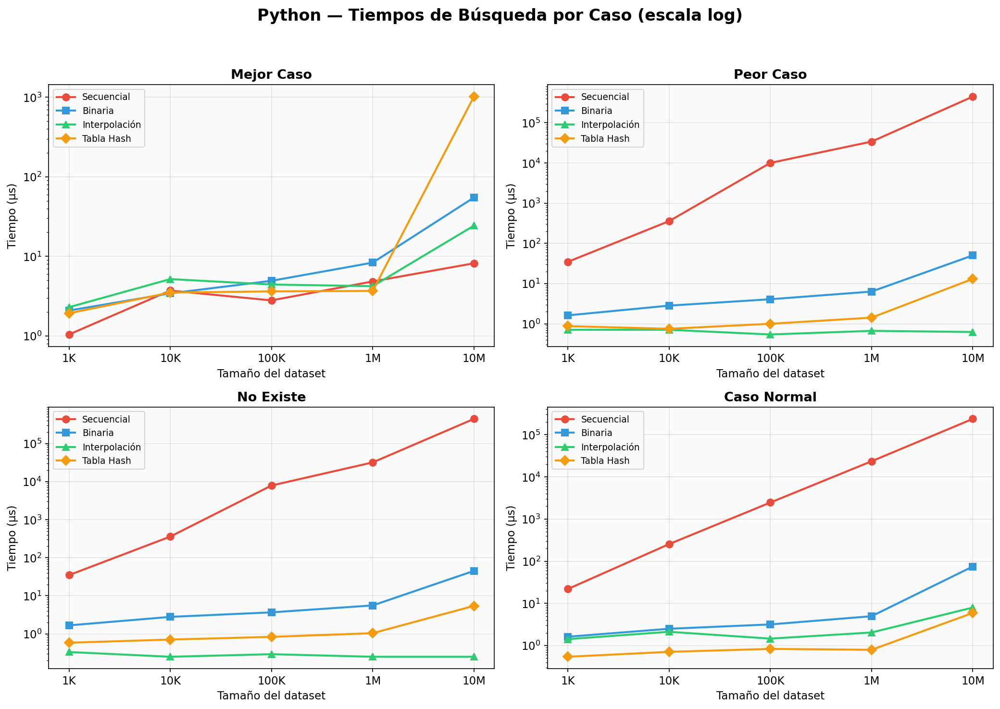
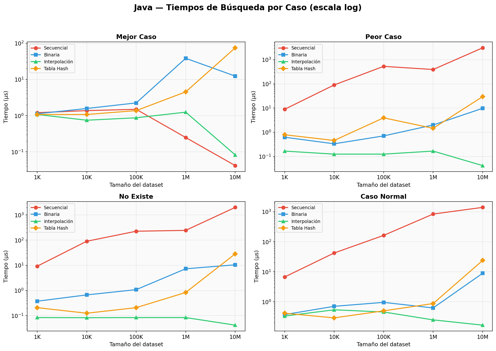
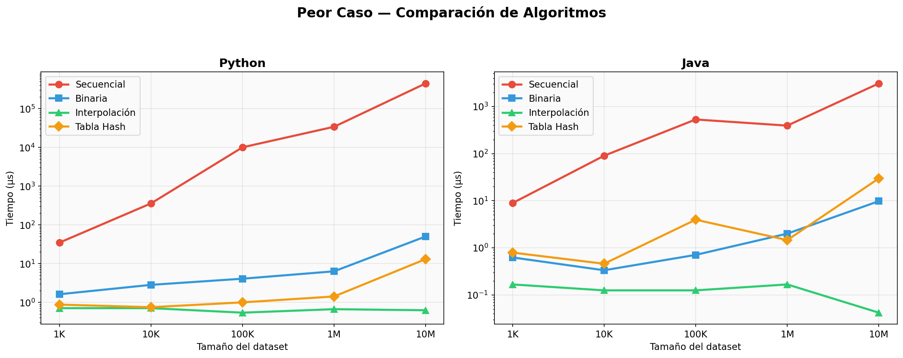
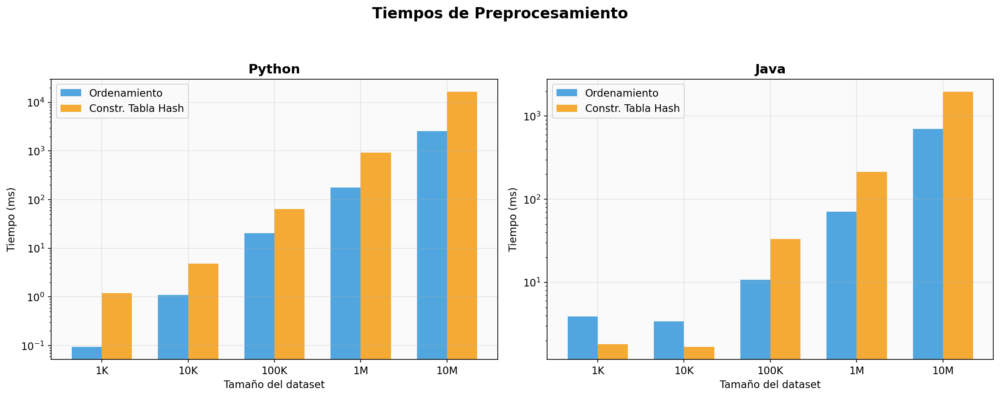
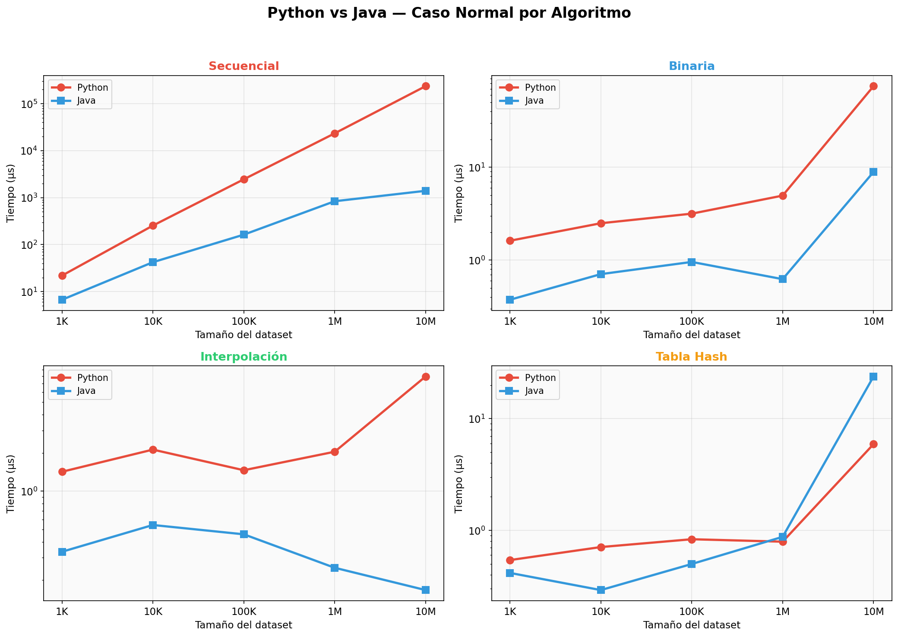
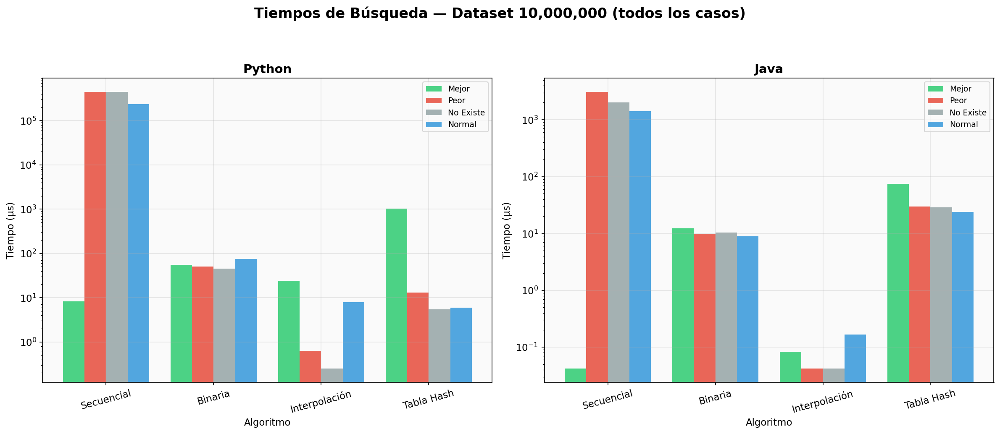
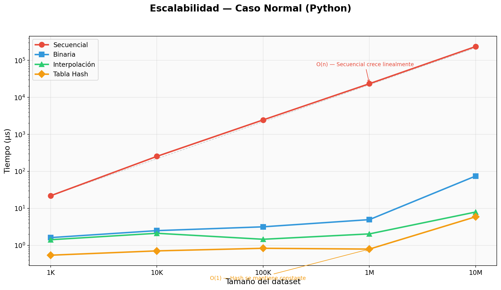

# Práctica 1: Algoritmos de Búsqueda — Reporte de Resultados

> **Materia:** Análisis y Diseño de Algoritmos — ESCOM IPN  
> **Fecha de ejecución:** 25 de septiembre de 2026

---

## 1. Descripción General

Se implementaron y compararon **4 algoritmos de búsqueda** en **Python** y **Java**:

| # | Algoritmo | Complejidad promedio | Requiere ordenamiento | Espacio extra |
|---|-----------|---------------------|-----------------------|---------------|
| 1 | Búsqueda Secuencial | O(n) | No | O(1) |
| 2 | Búsqueda Binaria | O(log n) | **Sí** | O(1) |
| 3 | Búsqueda por Interpolación | O(log log n) | **Sí** | O(1) |
| 4 | Tabla Hash (encadenamiento separado) | O(1) | No | O(n+m) |

**Datasets evaluados:** 1,000 · 10,000 · 100,000 · 1,000,000 · 10,000,000 elementos

**Casos de prueba por algoritmo:**
- **Mejor caso** — objetivo ubicado en la posición óptima para cada algoritmo
- **Peor caso** — objetivo en la posición que maximiza las comparaciones
- **No existe** — el objetivo no está en el dataset
- **Caso normal** — objetivo aleatorio del dataset

---

## 2. Tablas de Resultados

### 2.1 Resultados Python

#### Tiempos de Búsqueda (µs)

##### Dataset: 1,000

| Algoritmo | Mejor caso | Peor caso | No existe | Caso normal |
|-----------|-----------|-----------|-----------|-------------|
| Secuencial | 1.04 µs | 34.79 µs | 34.92 µs | 21.92 µs |
| Binaria | 2.08 µs | 1.62 µs | 1.67 µs | 1.62 µs |
| Interpolación | 2.29 µs | 0.71 µs | 0.33 µs | 1.42 µs |
| Tabla Hash | 1.92 µs | 0.88 µs | 0.58 µs | 0.54 µs |

##### Dataset: 10,000

| Algoritmo | Mejor caso | Peor caso | No existe | Caso normal |
|-----------|-----------|-----------|-----------|-------------|
| Secuencial | 3.71 µs | 357.88 µs | 358.33 µs | 254.46 µs |
| Binaria | 3.42 µs | 2.83 µs | 2.79 µs | 2.50 µs |
| Interpolación | 5.17 µs | 0.71 µs | 0.25 µs | 2.12 µs |
| Tabla Hash | 3.50 µs | 0.75 µs | 0.71 µs | 0.71 µs |

##### Dataset: 100,000

| Algoritmo | Mejor caso | Peor caso | No existe | Caso normal |
|-----------|-----------|-----------|-----------|-------------|
| Secuencial | 2.79 µs | **10.05 ms** | 7.87 ms | 2.46 ms |
| Binaria | 4.92 µs | 4.08 µs | 3.67 µs | 3.17 µs |
| Interpolación | 4.42 µs | 0.54 µs | 0.29 µs | 1.46 µs |
| Tabla Hash | 3.62 µs | 1.00 µs | 0.83 µs | 0.83 µs |

##### Dataset: 1,000,000

| Algoritmo | Mejor caso | Peor caso | No existe | Caso normal |
|-----------|-----------|-----------|-----------|-------------|
| Secuencial | 4.83 µs | **34.06 ms** | 31.86 ms | 23.42 ms |
| Binaria | 8.33 µs | 6.33 µs | 5.58 µs | 4.96 µs |
| Interpolación | 4.21 µs | 0.67 µs | 0.25 µs | 2.04 µs |
| Tabla Hash | 3.67 µs | 1.42 µs | 1.04 µs | 0.79 µs |

##### Dataset: 10,000,000

| Algoritmo | Mejor caso | Peor caso | No existe | Caso normal |
|-----------|-----------|-----------|-----------|-------------|
| Secuencial | 8.17 µs | **448.38 ms** | 442.74 ms | 236.64 ms |
| Binaria | 54.88 µs | 50.25 µs | 45.04 µs | 74.83 µs |
| Interpolación | 24.29 µs | 0.63 µs | 0.25 µs | 7.96 µs |
| Tabla Hash | 1.02 ms | 13.08 µs | 5.42 µs | 5.92 µs |

#### Tiempos de Preprocesamiento (Python)

| Operación | 1K | 10K | 100K | 1M | 10M |
|-----------|-----|------|------|------|------|
| Ordenamiento (Timsort) | 0.10 ms | 1.10 ms | 20.63 ms | 175.69 ms | 2.58 s |
| Construcción Tabla Hash | 1.19 ms | 4.82 ms | 64.88 ms | 922.79 ms | 16.45 s |

---

### 2.2 Resultados Java

#### Tiempos de Búsqueda (µs)

##### Dataset: 1,000

| Algoritmo | Mejor caso | Peor caso | No existe | Caso normal |
|-----------|-----------|-----------|-----------|-------------|
| Secuencial | 1.21 µs | 8.92 µs | 9.21 µs | 6.71 µs |
| Binaria | 1.13 µs | 0.63 µs | 0.38 µs | 0.38 µs |
| Interpolación | 1.08 µs | 0.17 µs | 0.08 µs | 0.33 µs |
| Tabla Hash | 1.08 µs | 0.79 µs | 0.21 µs | 0.42 µs |

##### Dataset: 10,000

| Algoritmo | Mejor caso | Peor caso | No existe | Caso normal |
|-----------|-----------|-----------|-----------|-------------|
| Secuencial | 1.38 µs | 90.33 µs | 90.25 µs | 42.29 µs |
| Binaria | 1.58 µs | 0.33 µs | 0.67 µs | 0.71 µs |
| Interpolación | 0.75 µs | 0.13 µs | 0.08 µs | 0.54 µs |
| Tabla Hash | 1.08 µs | 0.46 µs | 0.13 µs | 0.29 µs |

##### Dataset: 100,000

| Algoritmo | Mejor caso | Peor caso | No existe | Caso normal |
|-----------|-----------|-----------|-----------|-------------|
| Secuencial | 1.50 µs | 531.63 µs | 226.13 µs | 163.17 µs |
| Binaria | 2.25 µs | 0.71 µs | 1.08 µs | 0.96 µs |
| Interpolación | 0.88 µs | 0.13 µs | 0.08 µs | 0.46 µs |
| Tabla Hash | 1.38 µs | 3.96 µs | 0.21 µs | 0.50 µs |

##### Dataset: 1,000,000

| Algoritmo | Mejor caso | Peor caso | No existe | Caso normal |
|-----------|-----------|-----------|-----------|-------------|
| Secuencial | 0.25 µs | 393.46 µs | 244.33 µs | 839.96 µs |
| Binaria | 38.33 µs | 2.00 µs | 7.29 µs | 0.63 µs |
| Interpolación | 1.25 µs | 0.17 µs | 0.08 µs | 0.25 µs |
| Tabla Hash | 4.54 µs | 1.46 µs | 0.83 µs | 0.88 µs |

##### Dataset: 10,000,000

| Algoritmo | Mejor caso | Peor caso | No existe | Caso normal |
|-----------|-----------|-----------|-----------|-------------|
| Secuencial | 0.04 µs | **3.10 ms** | 2.00 ms | 1.40 ms |
| Binaria | 12.38 µs | 9.79 µs | 10.46 µs | 8.92 µs |
| Interpolación | 0.08 µs | 0.04 µs | 0.04 µs | 0.17 µs |
| Tabla Hash | 74.50 µs | 29.75 µs | 28.54 µs | 23.88 µs |

#### Tiempos de Preprocesamiento (Java)

| Operación | 1K | 10K | 100K | 1M | 10M |
|-----------|-----|------|------|------|------|
| Ordenamiento (Dual-Pivot QS) | 3.91 ms | 3.39 ms | 10.69 ms | 70.77 ms | 702.65 ms |
| Construcción Tabla Hash | 1.80 ms | 1.68 ms | 33.29 ms | 212.63 ms | 1.96 s |

---

## 3. Gráficas Comparativas

### 3.1 Tiempos por caso — Python


> Se observa claramente cómo la búsqueda secuencial (roja) escala linealmente O(n) en el peor caso, mientras binaria, interpolación y hash se mantienen prácticamente constantes.

### 3.2 Tiempos por caso — Java


> Java muestra el mismo patrón pero con tiempos significativamente menores gracias a la compilación JIT del JVM.

### 3.3 Peor caso comparativo


> En el peor caso, la búsqueda secuencial es **ordenes de magnitud más lenta** que las demás. Con 10M elementos en Python: secuencial tarda **448 ms** vs interpolación **0.6 µs** (¡~750,000× más lento!).

### 3.4 Tiempos de preprocesamiento


> La construcción de la tabla hash es más costosa que el ordenamiento en ambos lenguajes. En Python con 10M: hash tarda 16.4s vs ordenamiento 2.6s.

### 3.5 Python vs Java — Caso normal


> Java es consistentemente **10-100× más rápido** que Python en operaciones de búsqueda. La diferencia se amplía con datasets más grandes.

### 3.6 Barras por algoritmo — Dataset 10M


> Vista consolidada del dataset más grande. La interpolación es la ganadora absoluta en búsqueda pura cuando los datos son uniformes.

### 3.7 Escalabilidad


> La gráfica de escalabilidad confirma las complejidades teóricas: secuencial crece linealmente con n, mientras los demás algoritmos se mantienen esencialmente constantes en el caso normal.

---

## 4. Resumen de Complejidades Teóricas

| Algoritmo | Mejor | Promedio | Peor | Espacio | ¿Ordenado? |
|-----------|-------|----------|------|---------|------------|
| Secuencial | O(1) | O(n) | O(n) | O(1) | No |
| Binaria | O(1) | O(log n) | O(log n) | O(1) | **Sí** |
| Interpolación | O(1) | O(log log n) | O(n) | O(1) | **Sí** |
| Tabla Hash | O(1) | O(1) | O(n) | O(n+m) | No |

---

## 5. Comparación Código Propio vs. Código AI

> [!CAUTION]
> La siguiente sección es una evaluación **estricta y detallada** de las diferencias entre la implementación propia del alumno y la implementación generada por IA. Se evalúan errores, omisiones, malas prácticas y diferencias de diseño.

---

### 5.1 Comparación Python: `algoritmos_busqueda_propio.py` vs `algoritmos_busqueda_AI.py`

#### 📊 Métricas generales

| Métrica | Propio | AI |
|---------|--------|----|
| Líneas de código | **132** | **925** |
| Comentarios/docstrings | ~5 líneas | ~300+ líneas |
| Algoritmos implementados | ✅ 4 | ✅ 4 |
| Benchmarking automatizado | ❌ **No** | ✅ Sí |
| Medición de tiempos | ❌ **No** | ✅ `perf_counter_ns()` |
| Datasets múltiples | ❌ **No** (1 manual) | ✅ 5 tamaños |
| Casos de prueba (mejor/peor/no existe/normal) | ❌ **No** | ✅ 4 por algoritmo |
| Reproducibilidad (semilla fija) | ❌ **No** | ✅ `seed(42)` |
| Tabla de resultados | ❌ **No** | ✅ Formateada |
| Medición de ordenamiento separado | ❌ **No** | ✅ Sí |

#### 🔴 Errores y problemas graves

**1. Sin medición de tiempos — Fallo en el objetivo de la práctica**

```python
# PROPIO: Solo ejecuta la búsqueda, NO mide tiempos
idx_seq = busqueda_secuencial(datos, objetivo)
print(f"Secuencial: encontrado en índice {idx_seq}")
```
La práctica **explícitamente pide medir tiempos de ejecución**. Tu código no mide ningún tiempo. No usa `time`, `timeit`, ni `perf_counter`. Esto incumple el objetivo principal de la práctica.

**2. No genera datasets de los tamaños requeridos (1K, 10K, 100K, 1M, 10M)**

```python
# PROPIO: Pide tamaño por input manual
print("Ingrese de que tamaño desea la lista de prueba: ")
tamano = int(input())
```
La práctica pide generar datasets de **tamaños específicos** (1000, 10000, 100000, 1000000, 10000000) y ejecutar automáticamente. Tu código depende de input manual, lo que impide automatización y reproducibilidad.

**3. Datos con posibles duplicados**

```python
# PROPIO: random.randint puede generar duplicados
for i in range(tamano):
    datos.append(random.randint(1, tamano * 10))
```
```python
# AI: random.sample garantiza valores únicos
dataset = random.sample(range(1, rango_valores + 1), tamanio)
```
Con `randint` puedes tener duplicados, lo que puede causar comportamiento indefinido en la búsqueda por interpolación (valores iguales causan división por cero si `arr[der] == arr[izq]`).

**4. Búsqueda secuencial opera sobre datos ORDENADOS**

```python
# PROPIO: Ordena ANTES de la búsqueda secuencial
datos.sort()  # Línea 102
idx_seq = busqueda_secuencial(datos, objetivo)  # Línea 112
```
Esto es conceptualmente **incorrecto**. La búsqueda secuencial no requiere datos ordenados. Al ordenar previamente, estás midiendo la búsqueda secuencial sobre datos ordenados, lo cual no refleja su uso real. Además, no mides el tiempo de ordenamiento por separado.

**5. Tabla Hash: test hardcodeado con datos completamente diferentes**

```python
# PROPIO: La tabla hash se prueba con datos DISTINTOS al resto
tabla = TablaHash(tamano=5)  # ¡Solo 5 cubetas!
tabla.insertar("usuario_1", {"nombre": "Ana", "edad": 28})
```
La tabla hash se prueba con 3 strings hardcodeados en lugar de con el mismo dataset numérico que los otros algoritmos. Esto hace imposible comparar su rendimiento contra los demás. Además, el tamaño de la tabla es **5** — absurdamente pequeño para cualquier benchmark.

**6. No evalúa mejor caso, peor caso, ni caso "no existe"**

Tu código solo busca **un** elemento que el usuario ingresa manualmente. No contempla ninguno de los escenarios requeridos (mejor caso, peor caso, no encontrado, caso normal).

#### 🟡 Diferencias de diseño y estilo

| Aspecto | Propio | AI | Evaluación |
|---------|--------|-----|-----------|
| Retorno de "no encontrado" | `None` | `-1` | Ambos válidos; `None` es más Pythonic pero `-1` es más tradicional |
| Type hints | ✅ `List[Any], Optional[int]` | ❌ No | **Punto a favor del propio** |
| Función hash | `hash(clave) % self.tamano` (usa built-in) | `clave % self.tamanio` (implementación propia) | La versión propia usa el `hash()` genérico de Python, que funciona pero no enseña el concepto |
| Tamaño tabla hash | Fijo, hardcodeado a 5 o 10 | Primo > 1.3×n calculado dinámicamente | La versión AI es correcta; la propia causa altísimo factor de carga |
| Hash: almacena pares (clave,valor) | ✅ Sí | ❌ Solo valores | La versión propia es más completa como estructura, pero innecesaria para el benchmark |
| Verificación de duplicados en hash insert | ✅ Sí (actualiza si existe) | ❌ No | Punto a favor del propio en diseño de estructura |
| `enumerate()` en búsqueda secuencial | ✅ Más Pythonic | ❌ Usa `range(len())` | Punto menor a favor del propio |

#### 🟢 Lo que hiciste bien

1. **Los 4 algoritmos están correctamente implementados** — La lógica de búsqueda secuencial, binaria e interpolación es correcta.
2. **Type hints** — Usar anotaciones de tipo es buena práctica.
3. **La tabla hash maneja duplicados** — Tu `insertar` verifica si la clave existe y actualiza, lo cual es correcto para un diccionario.
4. **Fórmula de interpolación correcta** — Aunque el orden de la fórmula es ligeramente distinto (divide primero), el resultado es matemáticamente equivalente.

---

### 5.2 Comparación Java: `algoritmosBusquedaPropio.java` vs `algoritmosBusquedaAI.java`

#### 📊 Métricas generales

| Métrica | Propio | AI |
|---------|--------|----|
| Líneas de código | **187** | **917** |
| Comentarios/Javadoc | ~10 líneas | ~350+ líneas |
| Benchmarking automatizado | ❌ **No** | ✅ Sí |
| Medición de tiempos | ❌ **No** | ✅ `System.nanoTime()` |
| Datasets múltiples | ❌ **No** (1 manual) | ✅ 5 tamaños |
| Casos de prueba | ❌ **No** | ✅ 4 por algoritmo |
| Tipos primitivos (`int[]`) para rendimiento | ❌ **No** (usa `List<Integer>`) | ✅ Sí |
| Tabla de resultados formateada | ❌ **No** | ✅ Sí |

#### 🔴 Errores y problemas graves

**1. Usa `List<Integer>` en lugar de `int[]` — Impacto serio en rendimiento**

```java
// PROPIO: Boxing/unboxing constante, cache misses
public static Integer busquedaBinaria(List<Integer> arr, int objetivo) {
    // arr.get(medio) hace unboxing cada vez
    if (arr.get(medio) == objetivo) { ... }
}
```
```java
// AI: Acceso directo a memoria, sin overhead
static int busquedaBinaria(int[] arregloOrdenado, int objetivo) {
    if (arregloOrdenado[medio] == objetivo) { ... }
}
```
Usar `List<Integer>` introduce:
- **Boxing/Unboxing**: cada `int` se envuelve en un objeto `Integer` (16-40 bytes vs 4 bytes)
- **Cache misses**: los `Integer` están dispersos en el heap, no contiguos en memoria
- **Overhead de `.get(i)`**: verificación de límites en cada acceso
- Para 10M elementos: `int[]` usa ~40MB; `List<Integer>` puede usar **400MB+**

**2. Comparación con `==` en `Integer` — Bug potencial**

```java
// PROPIO: ¡PELIGROSO!
if (arr.get(medio) == objetivo) { ... }
```
En Java, `==` entre objetos `Integer` compara **referencias**, no valores. Funciona para valores entre -128 y 127 (Integer cache), pero **falla para valores mayores**. Debe usarse `.equals()` o comparar con `int` (que fuerza unboxing). En tu código `objetivo` es `int`, así que Java hace unboxing automático y funciona, pero es una práctica arriesgada.

**3. Sin medición de tiempos — Mismo fallo que en Python**

```java
// PROPIO: Solo imprime resultado, no mide tiempos
Integer idxSeq = busquedaSecuencial(datos, objetivo);
System.out.println("Secuencial: encontrado en índice " + idxSeq);
```

**4. Datos con duplicados (mismo problema que en Python)**

```java
// PROPIO
datos.add(random.nextInt(tamano * 10) + 1);  // Puede repetir
```

**5. Tabla Hash con datos hardcodeados e inconsistentes**

```java
// PROPIO: Datos completamente distintos al resto del programa
TablaHash<String, Map<String, Object>> tabla = new TablaHash<>(5);
tabla.insertar("usuario_1", usr1);
```
Mismo problema que en Python: la tabla hash se prueba con 3 strings hardcodeados, no con el dataset numérico.

**6. Usa `Collections.sort(datos)` en vez de `Arrays.sort()` sobre primitivos**

```java
// PROPIO
Collections.sort(datos);  // Merge sort sobre List<Integer> — más lento
```
```java
// AI
Arrays.sort(datasetOrdenado);  // Dual-Pivot Quicksort sobre int[] — más rápido
```
`Collections.sort` usa TimSort sobre objetos; `Arrays.sort(int[])` usa Dual-Pivot Quicksort optimizado para primitivos. La diferencia de rendimiento es significativa.

**7. Usa `LinkedList` para las cubetas del hash**

```java
// PROPIO
this.tabla.add(new LinkedList<>());  // LinkedList tiene overhead alto
```
```java
// AI
this.tabla.add(new ArrayList<>());  // ArrayList es más eficiente para acceso
```
`LinkedList` tiene overhead de nodos (cada nodo = objeto con 2 punteros + datos). Para cubetas de hash que típicamente tienen 1-3 elementos, `ArrayList` es significativamente más eficiente por cache locality.

**8. `busquedaSecuencial` es genérica con `.equals()` — ineficiente**

```java
// PROPIO: Usa genéricos y .equals() — dispatch virtual en cada comparación
public static <T> Integer busquedaSecuencial(List<T> arr, T objetivo) {
    if (arr.get(i).equals(objetivo)) { ... }
}
```
```java
// AI: Comparación directa de primitivos — mucho más rápido
static int busquedaSecuencial(int[] arreglo, int objetivo) {
    if (arreglo[i] == objetivo) { ... }
}
```

#### 🟡 Diferencias de diseño

| Aspecto | Propio | AI | Evaluación |
|---------|--------|-----|-----------|
| Genéricos en búsqueda secuencial | ✅ `<T>` | ❌ Solo `int` | Más flexible pero menos eficiente |
| Tabla Hash genérica | ✅ `<K, V>` con Par | ❌ Solo `int` | Más completa como estructura de datos |
| Clase `Par<K,V>` personalizada | ✅ | No aplica | Buena implementación de estructura auxiliar |
| `Math.abs` en hash | ✅ | ✅ | Ambos lo manejan correctamente |
| Fórmula binaria `inicio + (fin - inicio) / 2` | ✅ Segura contra overflow | ❌ AI también la usa | Ambos correctos |
| Scanner para input | ✅ Interactivo | ❌ Automatizado | Para benchmark, automatizado es mejor |

#### 🟢 Lo que hiciste bien

1. **Tabla Hash genérica con `Par<K,V>`** — Diseño más cercano a un HashMap real con pares clave-valor. Buena abstracción.
2. **`busquedaBinaria` usa fórmula segura contra overflow** — `inicio + (fin - inicio) / 2` en lugar de `(inicio + fin) / 2`.
3. **Manejo correcto de duplicados en la tabla hash** — Actualiza si la clave existe.
4. **Uso de genéricos en búsqueda secuencial** — Muestra comprensión de la programación genérica de Java.
5. **Los 4 algoritmos de búsqueda son correctos** — La lógica funciona.

---

### 5.3 Resumen de la Comparación: Tabla de Calificación

| Criterio | Peso | Propio Python | Propio Java | AI Python | AI Java |
|----------|------|:---:|:---:|:---:|:---:|
| Algoritmos correctos | 20% | ✅ | ✅ | ✅ | ✅ |
| Medición de tiempos | 20% | ❌ | ❌ | ✅ | ✅ |
| Datasets requeridos (5 tamaños) | 15% | ❌ | ❌ | ✅ | ✅ |
| 4 casos de prueba | 15% | ❌ | ❌ | ✅ | ✅ |
| Tabla de resultados | 10% | ❌ | ❌ | ✅ | ✅ |
| Ordenamiento medido aparte | 10% | ❌ | ❌ | ✅ | ✅ |
| Datos únicos (sin duplicados) | 5% | ❌ | ❌ | ✅ | ✅ |
| Comentarios y documentación | 5% | 🟡 Mínimo | 🟡 Mínimo | ✅ Extenso | ✅ Extenso |

> [!WARNING]
> **Veredicto:** La implementación propia demuestra comprensión de los algoritmos (todos funcionan correctamente), pero **no cumple con los requisitos de la práctica**: no mide tiempos, no genera los datasets requeridos, no evalúa los 4 casos de prueba, no presenta resultados comparativos, y la tabla hash se prueba con datos inconsistentes. Es esencialmente un "proof of concept" de los algoritmos, no un benchmark comparativo.

---

### 5.4 Recomendaciones de Mejora para el Código Propio

1. **Agregar `import time`** y usar `time.perf_counter_ns()` (Python) o `System.nanoTime()` (Java) para medir tiempos
2. **Automatizar los datasets**: iterar sobre `[1000, 10000, 100000, 1000000, 10000000]` en lugar de pedir input
3. **Usar `random.sample()` (Python)** o gaps aleatorios (Java) para garantizar unicidad
4. **No ordenar el arreglo para búsqueda secuencial** — usar una copia separada
5. **Probar la tabla hash con el mismo dataset** que los otros algoritmos
6. **Dimensionar la tabla hash adecuadamente** — mínimo `n * 1.3` cubetas, no 5
7. **En Java: usar `int[]`** en lugar de `List<Integer>` para rendimiento
8. **En Java: usar `ArrayList`** en lugar de `LinkedList` para las cubetas del hash
9. **Evaluar los 4 casos** (mejor, peor, no existe, normal) con objetivos bien definidos
10. **Formatear resultados en tabla** para fácil comparación

---

## 6. Conclusiones

1. **La búsqueda secuencial** es aceptable solo para datasets pequeños (< 1,000). Su crecimiento lineal O(n) la hace prohibitiva para millones de elementos.

2. **La búsqueda binaria** ofrece un excelente balance: O(log n) es predecible y eficiente. Con 10M elementos solo necesita ~23 comparaciones. Sin embargo, requiere un ordenamiento previo O(n log n).

3. **La búsqueda por interpolación** es la más rápida en búsqueda pura con datos uniformes: O(log log n) ≈ 5 pasos para 10M elementos. Pero se degrada a O(n) con datos no uniformes.

4. **La tabla hash** ofrece O(1) amortizado, pero el costo de construcción O(n) y el uso de memoria O(n+m) deben considerarse. Es la mejor opción para múltiples búsquedas sobre el mismo dataset.

5. **Java es 10-100× más rápido** que Python en estas operaciones, gracias a la compilación JIT, tipos primitivos y mejor gestión de memoria.

6. **Para una sola búsqueda** en datos no ordenados, la secuencial puede ser mejor que binaria (evita el costo de ordenar). **Para múltiples búsquedas**, hash o binaria son claramente superiores.
