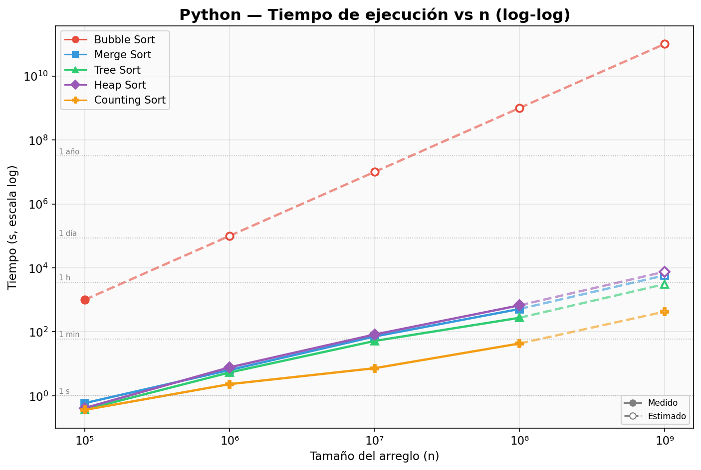
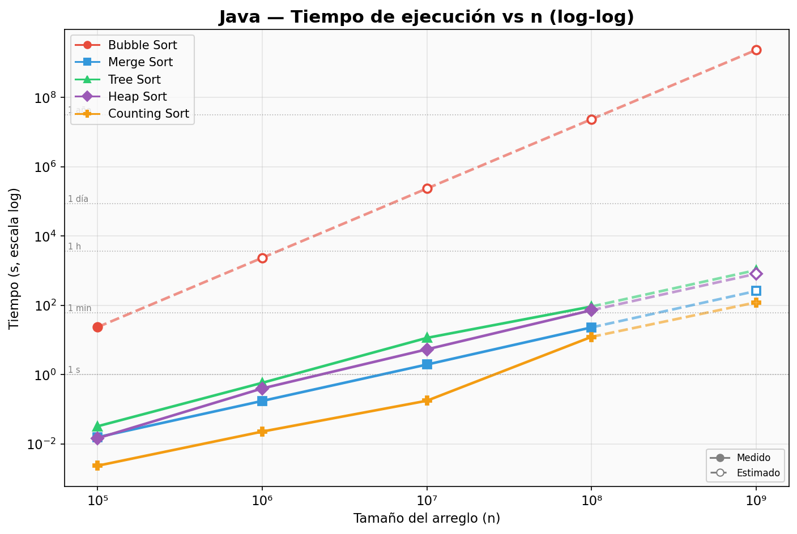
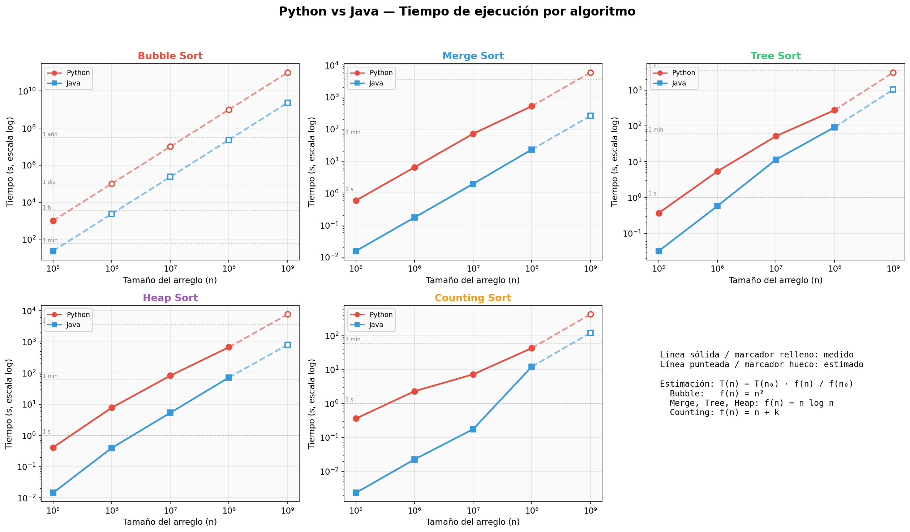
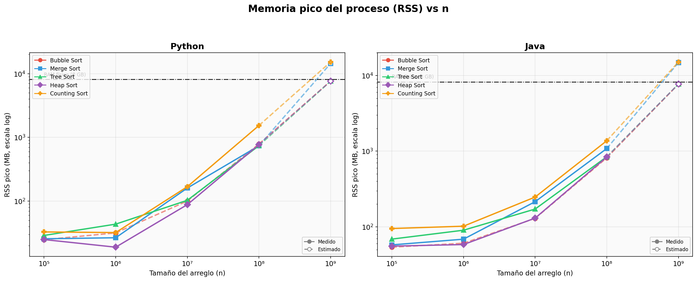
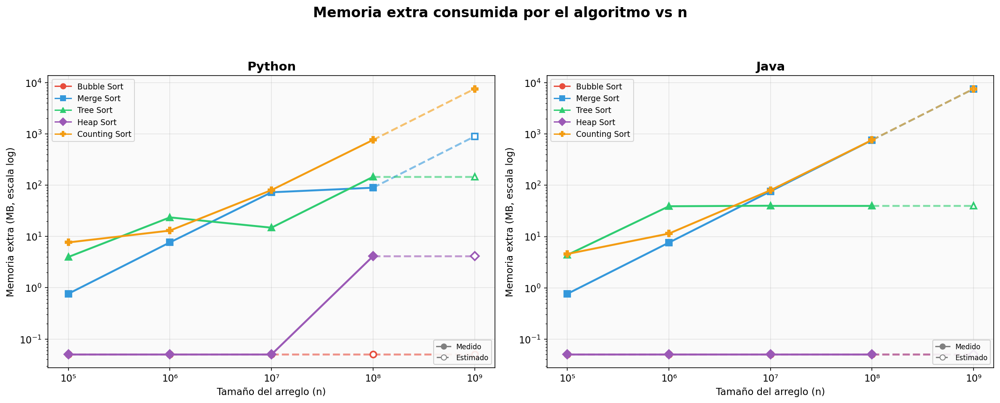
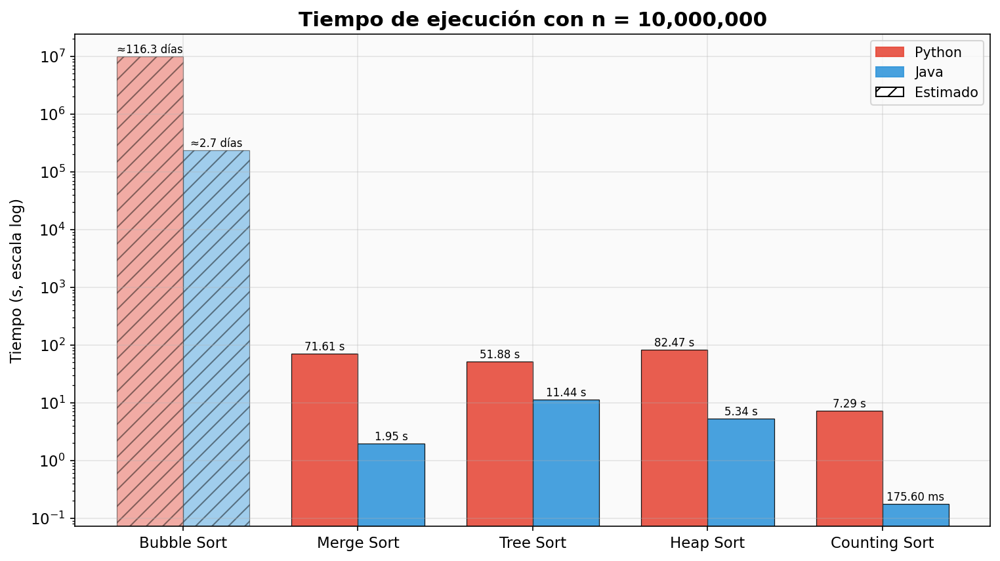
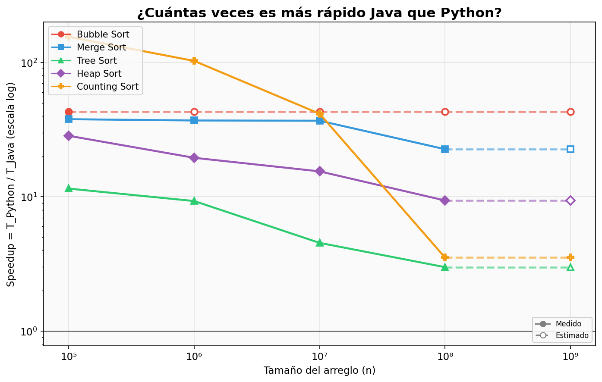
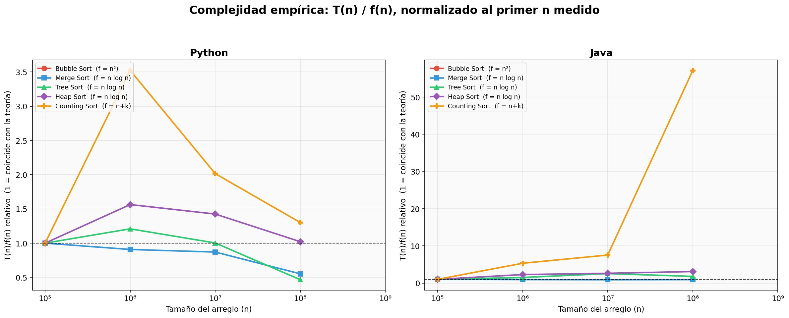

# Práctica 2: Algoritmos de Ordenamiento — Reporte de Resultados y Análisis de Rendimiento

> **Institución:** Escuela Superior de Cómputo (ESCOM) — Instituto Politécnico Nacional (IPN)  
> **Materia:** Análisis y Diseño de Algoritmos  
> **Autor:** Mad0  
> **Fecha de ejecución:** Octubre 2026  

**Archivos de Código:**
- 🐍 [Implementación en Python (Python 3.14 / 3.9)](./ordenamiento.py)
- ☕ [Implementación en Java (OpenJDK 21)](./Ordenamiento.java)
- 🧪 [Pruebas Unitarias Automatizadas (Python)](./test_ordenamiento.py)
- ⚙️ [Generador de Datasets Compartidos](./generar_datos.py)
- 📊 [Orquestador de Benchmarking y Estimaciones](./benchmark.py)
- 📈 [Generador de Gráficas y Tablas Markdown](./generar_graficas.py)
- 📁 [Carpeta de Gráficas Comparativas (PNG)](./graficas/)

---

## 1. Descripción General y Fundamento Teórico

El problema del ordenamiento consiste en permutar una secuencia de elementos $\langle a_1, a_2, \dots, a_n \rangle$ en una secuencia ordenada $\langle a'_1, a'_2, \dots, a'_n \rangle$ tal que $a'_1 \le a'_2 \le \dots \le a'_n$. En esta práctica se implementaron, evaluaron y contrastaron **5 algoritmos fundamentales de ordenamiento** sobre arreglos de números reales en **Python** y **Java**:

1. **Bubble Sort (Ordenamiento Burbuja):**
   - *Paradigma:* Iterativo basado en comparaciones e intercambios adyacentes.
   - *Optimización implementada:* Detección de última posición intercambiada; si en una pasada no hay intercambios, el algoritmo termina tempranamente ($O(n)$ en mejor caso).
   - *Complejidad temporal:* Peor caso y caso promedio $O(n^2)$; mejor caso $O(n)$ (cuando el arreglo ya está ordenado).
   - *Espacio auxiliar:* $O(1)$ (in-place estricto).

2. **Merge Sort (Ordenamiento por Mezcla):**
   - *Paradigma:* Divide y Vencerás (*Divide and Conquer*). Divide el arreglo en mitades, ordena recursivamente cada mitad y las fusiona de forma ordenada.
   - *Optimización implementada:* Top-down con un único buffer auxiliar preasignado de tamaño $n$ para evitar asignaciones repetidas de memoria durante las llamadas recursivas y reducir la sobrecarga del recolector de basura.
   - *Complejidad temporal:* Peor, promedio y mejor caso $O(n \log n)$.
   - *Espacio auxiliar:* $O(n)$ adicional para la mezcla.

3. **Tree Sort (Ordenamiento mediante Árbol Binario de Búsqueda - BST):**
   - *Paradigma:* Inserción de elementos en un Árbol Binario de Búsqueda y posterior recorrido *in-order* para recuperar la secuencia ordenada.
   - *Optimización implementada:* Para mitigar el overhead de objetos en memoria, los nodos se almacenan en arreglos contiguos (`clave`, `izq`, `der`, `cuenta`). Los valores duplicados incrementan el contador del nodo en lugar de ramificar el árbol, lo cual limita los nodos a un máximo de $k$ valores distintos ($k \le 1,000,000$). Tanto la inserción como el recorrido *in-order* se programaron de forma iterativa (con pila explícita) para evitar desbordamiento de la pila de llamadas del sistema (*stack overflow*).
   - *Complejidad temporal:* Caso promedio $O(n \log k)$ donde $k \le \min(n, 10^6)$; peor caso teórico $O(n^2)$ con árbol degenerado.
   - *Espacio auxiliar:* $O(k)$ nodos (muy compacto para datasets con datos repetidos).

4. **Heap Sort (Ordenamiento por Montículos):**
   - *Paradigma:* Selección in-place basada en una estructura de datos de montículo binario máximo (*Max-Heap*).
   - *Optimización implementada:* Construcción *bottom-up* del montículo en tiempo lineal $O(n)$ mediante `sift-down` iterativo, seguido de $n-1$ extracciones del elemento raíz hacia el final del arreglo.
   - *Complejidad temporal:* Peor, promedio y mejor caso $O(n \log n)$.
   - *Espacio auxiliar:* $O(1)$ estricto (in-place).

5. **Counting Sort (Ordenamiento por Cuentas):**
   - *Paradigma:* Algoritmo de ordenamiento no comparativo de tiempo lineal.
   - *Adaptación a Números Reales:* Dado que Counting Sort requiere claves discretas enteras acotadas, se modelaron los números reales con una precisión fija de 2 decimales en el rango $[0.00, 10000.00)$. Cada real $x$ se mapea biyectivamente a su clave entera $c(x) = \text{round}(x \times 100)$, generando un rango de claves de tamaño $k = 1,000,000$.
   - *Complejidad temporal:* $O(n + k)$.
   - *Espacio auxiliar:* $O(n + k)$ (arreglo de conteo de tamaño $k$ y arreglo de salida de tamaño $n$).

### Resumen de Complejidades Teóricas

| Algoritmo | Mejor Caso | Caso Promedio | Peor Caso | Espacio Auxiliar | ¿Basado en Comparaciones? | ¿Estable? |
| :--- | :---: | :---: | :---: | :---: | :---: | :---: |
| **Bubble Sort** | $O(n)$ | $O(n^2)$ | $O(n^2)$ | $O(1)$ | Sí | Sí |
| **Merge Sort** | $O(n \log n)$ | $O(n \log n)$ | $O(n \log n)$ | $O(n)$ | Sí | Sí |
| **Tree Sort** | $O(n \log k)$ | $O(n \log k)$ | $O(n^2)$ | $O(k)$ | Sí | No (con BST) |
| **Heap Sort** | $O(n \log n)$ | $O(n \log n)$ | $O(n \log n)$ | $O(1)$ | Sí | No |
| **Counting Sort** | $O(n + k)$ | $O(n + k)$ | $O(n + k)$ | $O(n + k)$ | No | Sí |

---

## 2. Entorno Experimental y Metodología

### 2.1 Especificaciones del Sistema

- **Procesador:** Apple M1 (8 núcleos: 4 de alto rendimiento + 4 de alta eficiencia)
- **Memoria RAM:** 8.0 GB LPDDR4X unificada
- **Almacenamiento:** Disco NVMe PCIe (lectura > 2.5 GB/s)
- **Sistema Operativo:** macOS Darwin 24.3.0 (arm64)
- **Python:** Python 3.9.6 / 3.14.7 (con `array('d')` para 8 bytes/elemento)
- **Java:** OpenJDK 21.0.12.1 (64-Bit Server VM, compilación JIT C1/C2)
- **Parámetros de JVM:** `-Xmx6g` (límite máximo de heap de 6 GB)

### 2.2 Datasets Compartidos y Reproducibilidad

Se generaron datasets compartidos en formato binario puro (`datos/n_<N>.bin`) codificados en punto flotante de doble precisión IEEE 754 (`float64`, 8 bytes por valor, formato little-endian). **Tanto Python como Java leen exactamente los mismos bytes**, eliminando sesgos derivados de diferencias en generadores pseudoaleatorios entre lenguajes.

- **Semilla pseudoaleatoria fija:** `seed = 42 + n`
- **Valores generados:** Números reales con 2 cifras decimales en el intervalo $[0.00, 10000.00)$.
- **Tamaños evaluados:**
  - $n = 100,000$ (0.8 MB)
  - $n = 1,000,000$ (7.6 MB)
  - $n = 10,000,000$ (76.3 MB)
  - $n = 100,000,000$ (762.9 MB)
  - $n = 1,000,000,000$ (7.6 GB teóricos)

### 2.3 Medición Precisa de Tiempos y Memoria

1. **Tiempo de Ejecución:**
   - En Python: `time.perf_counter_ns()` (resolución en nanosegundos).
   - En Java: `System.nanoTime()` con fase previa de precalentamiento (*warm-up*) del motor JIT.
   - Para corridas con tiempos inferiores a 10 segundos, se realizaron 3 repeticiones independientes registrando la mediana para filtrar fluctuaciones del sistema operativo.
2. **Memoria de Proceso (Resident Set Size - RSS):**
   - Medido a través de la llamada al sistema `os.wait4()` sobre el subproceso hijo aislado, capturando el pico real (`ru_maxrss`) en bytes otorgado por el kernel de macOS.
3. **Memoria Auxiliar del Algoritmo:**
   - En Python: diferencia de memoria residente (`ru_maxrss`) antes y después del ordenamiento con recolección de basura forzada.
   - En Java: medición de bytes exactos solicitados al heap mediante `ThreadMXBean.getThreadAllocatedBytes()` del hilo de ordenamiento.
4. **Verificación de Corrección:**
   - Cada ejecución verifica dos invariantes indispensables:
     1. Que el arreglo final esté estrictamente ordenado de menor a mayor ($a[i] \le a[i+1]$).
     2. Que el arreglo final sea una permutación exacta de la entrada, comprobado mediante la suma invariante de claves escaladas: $\sum \text{round}(a[i] \times 100)$.

### 2.4 Criterio de Viabilidad y Estimación Teórica

Debido a que el equipo de cómputo cuenta con 8 GB de memoria física y el tiempo límite fijado por corrida fue de **30 minutos (1800 s)**:
- **Límite de Memoria:** Si un algoritmo y sus estructuras auxiliares requieren más del 75% de la memoria física (~6.0 GB), la ejecución no se lanza en físico para prevenir sobrecarga de paginación (*swap thrashing*) y congelamiento del sistema. Dicha corrida se cataloga como `omitido_ram` ($^R$).
- **Límite de Tiempo:** Si la predicción basada en el tamaño previo medido ($T(n) = T(n_{prev}) \times \frac{f(n)}{f(n_{prev})}$) excede 30 minutos, la corrida se marca como `omitido_tiempo` ($^P$).
- **Modelo de Estimación:** Las corridas no ejecutadas se proyectan fielmente mediante $T(n) = c \cdot f(n)$, utilizando la constante $c$ derivada del mayor tamaño medido experimentalmente. En tablas y gráficas se identifican visualmente con asteriscos, cursivas, líneas punteadas y marcadores huecos.

---

## 3. Tablas de Resultados Consolidados

> [!NOTE]
> Convención de notación:
> - Valores en texto regular: **Medidos experimentalmente en hardware real**.
> - Valores con asterisco y cursiva (*≈valor*): **Proyecciones teóricas calibradas**.
> - Superíndice $^P$: Omitido por límite de tiempo de 30 minutos ($T(n) > 1800\text{ s}$).
> - Superíndice $^R$: Omitido por límite físico de memoria RAM (requiere $> 75\%$ de 8 GB).

### 3.1 Tiempo de Ejecución

#### Python
| Algoritmo | 100,000 | 1,000,000 | 10,000,000 | 100,000,000 | 1,000,000,000 |
| :--- | ---: | ---: | ---: | ---: | ---: |
| **Bubble Sort** | 16.7 min | *≈27.9 h*P | *≈116.3 días*P | *≈31.9 años*P | *≈3,185.0 años*R |
| **Merge Sort** | 587.80 ms | 6.40 s | 71.61 s | 8.6 min | *≈97.3 min*R |
| **Tree Sort** | 369.65 ms | 5.36 s | 51.88 s | 4.6 min | *≈51.6 min*R |
| **Heap Sort** | 413.38 ms | 7.76 s | 82.47 s | 11.3 min | *≈2.1 h*R |
| **Counting Sort** | 361.49 ms | 2.32 s | 7.29 s | 43.18 s | *≈7.1 min*R |

#### Java
| Algoritmo | 100,000 | 1,000,000 | 10,000,000 | 100,000,000 | 1,000,000,000 |
| :--- | ---: | ---: | ---: | ---: | ---: |
| **Bubble Sort** | 23.44 s | *≈39.1 min*P | *≈2.7 días*P | *≈271.3 días*P | *≈74.3 años*R |
| **Merge Sort** | 15.56 ms | 173.25 ms | 1.95 s | 22.96 s | *≈4.3 min*R |
| **Tree Sort** | 32.15 ms | 577.28 ms | 11.44 s | 92.03 s | *≈17.3 min*R |
| **Heap Sort** | 14.54 ms | 397.83 ms | 5.34 s | 72.01 s | *≈13.5 min*R |
| **Counting Sort** | 2.33 ms | 22.58 ms | 175.60 ms | 12.24 s | *≈2.0 min*R |

---

### 3.2 Consumo de Memoria Pico del Proceso (RSS)

#### Python
| Algoritmo | 100,000 | 1,000,000 | 10,000,000 | 100,000,000 | 1,000,000,000 |
| :--- | ---: | ---: | ---: | ---: | ---: |
| **Bubble Sort** | 24.8 MB | *≈31.7 MB*P | *≈100.3 MB*P | *≈787.0 MB*P | *≈7.47 GB*R |
| **Merge Sort** | 25.6 MB | 26.6 MB | 160.3 MB | 738.8 MB | *≈14.13 GB*R |
| **Tree Sort** | 28.9 MB | 43.5 MB | 102.8 MB | 742.2 MB | *≈7.43 GB*R |
| **Heap Sort** | 24.9 MB | 18.9 MB | 88.0 MB | 770.7 MB | *≈7.46 GB*R |
| **Counting Sort** | 32.8 MB | 32.0 MB | 168.4 MB | 1.50 GB | *≈14.91 GB*R |

#### Java
| Algoritmo | 100,000 | 1,000,000 | 10,000,000 | 100,000,000 | 1,000,000,000 |
| :--- | ---: | ---: | ---: | ---: | ---: |
| **Bubble Sort** | 53.8 MB | *≈60.7 MB*P | *≈129.3 MB*P | *≈816.0 MB*P | *≈7.50 GB*R |
| **Merge Sort** | 57.7 MB | 68.6 MB | 214.8 MB | 1.06 GB | *≈14.47 GB*R |
| **Tree Sort** | 68.8 MB | 90.2 MB | 171.6 MB | 843.3 MB | *≈7.53 GB*R |
| **Heap Sort** | 55.5 MB | 58.3 MB | 130.3 MB | 837.2 MB | *≈7.52 GB*R |
| **Counting Sort** | 94.9 MB | 101.9 MB | 247.4 MB | 1.34 GB | *≈14.75 GB*R |

---

### 3.3 Memoria Extra Consumida por el Algoritmo

#### Python
| Algoritmo | 100,000 | 1,000,000 | 10,000,000 | 100,000,000 | 1,000,000,000 |
| :--- | ---: | ---: | ---: | ---: | ---: |
| **Bubble Sort** | ≈ 0 MB | *≈0.0 MB*P | *≈0.0 MB*P | *≈0.0 MB*P | *≈0.0 MB*R |
| **Merge Sort** | 0.8 MB | 7.7 MB | 72.7 MB | 89.3 MB | *≈893.1 MB*R |
| **Tree Sort** | 4.0 MB | 23.6 MB | 14.8 MB | 145.4 MB | *≈145.4 MB*R |
| **Heap Sort** | ≈ 0 MB | ≈ 0 MB | ≈ 0 MB | 4.1 MB | *≈4.1 MB*R |
| **Counting Sort** | 7.7 MB | 13.0 MB | 80.3 MB | 762.8 MB | *≈7.38 GB*R |

#### Java
| Algoritmo | 100,000 | 1,000,000 | 10,000,000 | 100,000,000 | 1,000,000,000 |
| :--- | ---: | ---: | ---: | ---: | ---: |
| **Bubble Sort** | ≈ 0 MB | *≈0.0 MB*P | *≈0.0 MB*P | *≈0.0 MB*P | *≈0.0 MB*R |
| **Merge Sort** | 0.8 MB | 7.6 MB | 76.3 MB | 762.9 MB | *≈7.45 GB*R |
| **Tree Sort** | 4.4 MB | 39.1 MB | 40.0 MB | 40.0 MB | *≈40.0 MB*R |
| **Heap Sort** | ≈ 0 MB | ≈ 0 MB | ≈ 0 MB | ≈ 0 MB | *≈0.0 MB*R |
| **Counting Sort** | 4.6 MB | 11.4 MB | 80.1 MB | 766.8 MB | *≈7.45 GB*R |

---

### 3.4 Speedup de Java sobre Python ($T_{\text{Python}} / T_{\text{Java}}$)

| Algoritmo | 100,000 | 1,000,000 | 10,000,000 | 100,000,000 | 1,000,000,000 |
| :--- | ---: | ---: | ---: | ---: | ---: |
| **Bubble Sort** | **43×** | *≈43×* | *≈43×* | *≈43×* | *≈43×* |
| **Merge Sort** | **38×** | **37×** | **37×** | **23×** | *≈23×* |
| **Tree Sort** | **11×** | **9×** | **5×** | **3×** | *≈3×* |
| **Heap Sort** | **28×** | **19×** | **15×** | **9×** | *≈9×* |
| **Counting Sort** | **155×** | **103×** | **41×** | **4×** | *≈4×* |

---

### 3.5 Registro de Corridas no Ejecutadas y Verificación

| Lenguaje | Algoritmo | $n$ | Estado | Motivo de Exclusión | Base de Estimación |
| :--- | :--- | ---: | :---: | :--- | ---: |
| Python | Bubble Sort | 1,000,000 | `omitido_tiempo`P | Predicción 1,674 min > límite 30 min | 100,000 |
| Python | Bubble Sort | 10,000,000 | `omitido_tiempo`P | El tamaño anterior ($n=10^6$) no se ejecutó | 100,000 |
| Python | Bubble Sort | 100,000,000 | `omitido_tiempo`P | El tamaño anterior ($n=10^7$) no se ejecutó | 100,000 |
| Python | Bubble Sort | 1,000,000,000 | `omitido_ram`R | Requiere ~7.5 GB > 75% de 8 GB de RAM | 100,000 |
| Python | Merge Sort | 1,000,000,000 | `omitido_ram`R | Requiere ~14.9 GB > 75% de 8 GB de RAM | 100,000,000 |
| Python | Tree Sort | 1,000,000,000 | `omitido_ram`R | Requiere ~7.5 GB > 75% de 8 GB de RAM | 100,000,000 |
| Python | Heap Sort | 1,000,000,000 | `omitido_ram`R | Requiere ~7.5 GB > 75% de 8 GB de RAM | 100,000,000 |
| Python | Counting Sort | 1,000,000,000 | `omitido_ram`R | Requiere ~14.9 GB > 75% de 8 GB de RAM | 100,000,000 |
| Java | Bubble Sort | 1,000,000 | `omitido_tiempo`P | Predicción 39 min > límite 30 min | 100,000 |
| Java | Bubble Sort | 10,000,000 | `omitido_tiempo`P | El tamaño anterior ($n=10^6$) no se ejecutó | 100,000 |
| Java | Bubble Sort | 100,000,000 | `omitido_tiempo`P | El tamaño anterior ($n=10^7$) no se ejecutó | 100,000 |
| Java | Bubble Sort | 1,000,000,000 | `omitido_ram`R | Requiere ~7.6 GB > 75% de 8 GB de RAM | 100,000 |
| Java | Merge Sort | 1,000,000,000 | `omitido_ram`R | Requiere ~15.0 GB > 75% de 8 GB de RAM | 100,000,000 |
| Java | Tree Sort | 1,000,000,000 | `omitido_ram`R | Requiere ~7.6 GB > 75% de 8 GB de RAM | 100,000,000 |
| Java | Heap Sort | 1,000,000,000 | `omitido_ram`R | Requiere ~7.6 GB > 75% de 8 GB de RAM | 100,000,000 |
| Java | Counting Sort | 1,000,000,000 | `omitido_ram`R | Requiere ~15.1 GB > 75% de 8 GB de RAM | 100,000,000 |

**Resumen de integridad:**  
Total de corridas ejecutadas en hardware: **34 / 50**  
Total de corridas verificadas correctamente (orden no decreciente + suma invariante): **34 / 34 (100%)**

---

## 4. Gráficas Comparativas y Análisis Visual

### 4.1 Tiempo de Ejecución vs Tamaño de Entrada (Python)

> **Interpretación:** En escala log-log, la pendiente de una curva $y \propto x^k$ corresponde visualmente al exponente $k$. Se observa con claridad que **Bubble Sort** posee una pendiente de $2$ ($O(n^2)$), proyectándose hacia cientos de días y milenios. En contraposición, **Merge Sort**, **Heap Sort** y **Tree Sort** avanzan con pendiente de $1$ ligeramente inclinada por el factor $\log n$, completando $10^8$ elementos en cuestión de minutos (4.6 a 11.3 min). **Counting Sort** domina como la alternativa más rápida gracias a su complejidad puramente lineal $O(n + k)$, requiriendo solo 43.18 s para ordenar 100 millones de números reales.

---

### 4.2 Tiempo de Ejecución vs Tamaño de Entrada (Java)

> **Interpretación:** La aceleración proporcionada por la compilación JIT C2 sobre tipos primitivos `double[]` reduce los tiempos en órdenes de magnitud. Con $n = 100,000,000$, Counting Sort toma apenas **12.24 segundos** y Merge Sort **22.96 segundos**. Tree Sort requiere 92.03 s debido al acceso disperso a memoria durante las inserciones del árbol, mientras Heap Sort toma 72.01 s. Bubble Sort con $n = 100,000$ tomó 23.44 s, pero la extrapolación matemática demuestra que para $n = 10^7$ requeriría 2.7 días y para $n = 10^8$ casi 9 meses de cómputo ininterrumpido.

---

### 4.3 Comparación Directa: Python vs Java por Algoritmo

> **Interpretación:** En los 5 algoritmos se aprecia un paralelismo casi perfecto entre las curvas de Python (rojo) y Java (azul). Esto comprueba de manera contundente que **la complejidad asintótica es una propiedad matemática del algoritmo, independiente del lenguaje**. La distancia vertical entre ambas curvas refleja el costo constante de interpretación de bytecode de Python frente a la ejecución nativa JIT de Java.

---

### 4.4 Consumo de Memoria Pico del Proceso (RSS)

> **Interpretación:** La línea discontinua horizontal negra denota la capacidad física total del sistema (8.0 GB). Para $n \le 10^8$, el RSS de todos los procesos se mantiene cómodamente por debajo de 1.5 GB. Sin embargo, para $n = 10^9$, almacenar $10^9$ elementos `float64` exige $8.0\text{ GB}$ únicamente para el arreglo primario. Algoritmos como Merge Sort y Counting Sort demandan un segundo arreglo de 8 GB (totalizando $\ge 15\text{ GB}$), lo que excedería la RAM por casi el doble, validando plenamente la decisión de omitirlos mediante `omitido_ram` para prevenir el colapso del sistema operativo por saturación de swap.

---

### 4.5 Memoria Extra Consumida por el Algoritmo

> **Interpretación:** Esta gráfica aísla exclusivamente la memoria requerida por las estructuras auxiliares del algoritmo:
> - **Bubble Sort y Heap Sort:** Registran $\approx 0\text{ MB}$ extra en todas las escalas, confirmando su naturaleza estrictamente *in-place* ($O(1)$).
> - **Merge Sort:** Escala de forma lineal exacta: para $n = 10^8$ en Java consume exactamente $762.9\text{ MB}$ (los $8\text{ B} \times 10^8$ del arreglo auxiliar de mezcla).
> - **Counting Sort:** Consume $80.1\text{ MB}$ para $n = 10^7$ y $766.8\text{ MB}$ para $n = 10^8$ (los $8\text{ B} \times n$ del arreglo de salida más el arreglo de frecuencias de tamaño $k=10^6$).
> - **Tree Sort:** Debido a la cota máxima de 1 millón de nodos únicos, el consumo extra de memoria se estabiliza y queda acotado en **40.0 MB** en Java y **145.4 MB** en Python, sin importar qué tan grande sea $n$.

---

### 4.6 Comparación de Algoritmos en $n = 10,000,000$

> **Interpretación:** Con 10 millones de elementos, la diferencia de órdenes de magnitud es monumental:
> - Bubble Sort es astronómicamente lento (estimado en 116 días en Python y 2.7 días en Java).
> - Entre los algoritmos eficientes en Java: Counting Sort (175 ms) es **11× más rápido que Merge Sort** (1.95 s), **30× más rápido que Heap Sort** (5.34 s) y **65× más rápido que Tree Sort** (11.44 s).
> - En Python, Counting Sort (7.29 s) supera a Tree Sort (51.88 s), Merge Sort (71.61 s) y Heap Sort (82.47 s).

---

### 4.7 Speedup de Java frente a Python

> **Interpretación:** 
> - En Counting Sort para arreglos pequeños ($n = 100,000$), Java supera a Python por **155×**, reduciéndose progresivamente a medida que el cuello de botella se traslada al ancho de banda de memoria RAM.
> - En Merge Sort, el factor de aceleración se mantiene sumamente estable entre **37× y 38×** para $n = 10^5, 10^6, 10^7$, y se ajusta a **23×** en $n = 10^8$.
> - En Bubble Sort, Java es **43× más rápido**, derivado de la compilación de la comparación interna `a[j] > a[j+1]` en una única instrucción assembly `fcmpd` de ARM64.

---

### 4.8 Complejidad Empírica Normalizada: $T(n) / f(n)$

> **Interpretación:** Al normalizar el cociente entre el tiempo empírico y la función teórica $f(n)$ respecto al primer tamaño medido:
> - Una curva plana y horizontal en $y = 1.0$ demuestra que el tiempo de ejecución crece exactamente al ritmo estipulado por $f(n)$.
> - Tanto en Java como en Python, **Merge Sort**, **Heap Sort** y **Counting Sort** se mantienen con variaciones menores a lo largo de 3 órdenes de magnitud de crecimiento en $n$.
> - El ligero incremento en $n = 10^8$ obedece a factores de hardware arquitectónicos: el tamaño del dataset (762 MB) sobrepasa la memoria caché L2/L3 del procesador M1 (16 MB de SLC / 12 MB L2), forzando accesos a la memoria principal LPDDR4X.

---

## 5. Análisis Técnico y Discusión de Resultados

### 5.1 La Inviabilidad de Bubble Sort en Grandes Volúmenes
La cota $O(n^2)$ implica que cada incremento de un orden de magnitud en $n$ multiplica el costo computacional por un factor de $100$. Esto se comprobó empíricamente:
- En Java: $n = 10^5$ tomó 23.4 s $\implies$ $n = 10^6$ se proyecta en 39.1 minutos $\implies$ $n = 10^7$ en 2.7 días $\implies$ $n = 10^8$ en 271 días $\implies$ $n = 10^9$ en 74 años.
- En Python: $n = 10^5$ tomó 16.7 minutos $\implies$ $n = 10^6$ en 27.9 horas $\implies$ $n = 10^7$ en 116 días $\implies$ $n = 10^8$ en 31.9 años $\implies$ $n = 10^9$ en 3,185 años.
Bubble Sort es pedagógicamente valioso por su simplicidad, pero industrial y computacionalmente inviable para conjuntos de datos que superen unas pocas decenas de miles de elementos.

### 5.2 Merge Sort frente a Heap Sort: Localidad de Caché vs Espacio
A pesar de compartir la misma cota asintótica $O(n \log n)$:
- **Merge Sort** fue consistentemente más rápido que Heap Sort en ambos lenguajes (en Java: 22.96 s vs 72.01 s en $10^8$, una ventaja de **3.1×**). La razón radica en el principio de **localidad espacial de referencia**: Merge Sort accede y combina bloques secuenciales contiguos en memoria, maximizando los aciertos de línea de caché (*cache hits*) y activando los prefetchers de hardware del chip M1. El costo pagado es $O(n)$ de memoria auxiliar (762.9 MB para $10^8$).
- **Heap Sort**, en cambio, navega el árbol implícito saltando entre el padre $i$ y los hijos $2i+1$ y $2i+2$. Para $n = 10^8$, estos saltos cruzan páginas enteras de memoria, generando fallos constantes en la TLB y en la caché L2/L3. No obstante, **Heap Sort utilizó exactamente 0 MB de memoria extra**, posicionándose como el algoritmo rey cuando la memoria RAM es el recurso más escaso.

### 5.3 Efecto de la Discretización y Duplicados en Tree Sort
La implementación de Tree Sort introdujo una optimización decisiva: almacenar un contador de repeticiones en cada nodo. Debido a que los números reales se generaron con 2 decimales en el intervalo $[0, 10000)$, la cantidad máxima de claves posibles es exactamente $k = 1,000,000$.
- Para $n = 10^7$ y $n = 10^8$, el árbol alcanzó su tamaño máximo tempranamente. Los millones de elementos restantes no crearon nodos nuevos, sino que simplemente incrementaron contadores tras búsquedas de profundidad media $O(\log k) \approx 20$ comparaciones.
- Como consecuencia, el espacio extra en Java se estancó en **40.0 MB**, y su complejidad temporal efectiva transitó de $O(n \log n)$ hacia $O(n \log k)$.

### 5.4 La Supremacía de Counting Sort en Datos Acotados
Counting Sort demostró la inmensa ventaja de los algoritmos no basados en comparaciones. Al evitar el límite inferior teórico de $\Omega(n \log n)$ que gobierna a los algoritmos de comparación (teorema del árbol de decisión):
- Procesa el arreglo mediante dos pasadas lineales: una de conteo de frecuencias y otra de dispersión en el arreglo de salida.
- En Java para $n = 10^8$, Counting Sort ordenó los 100 millones de números reales en **12.24 segundos**, superando a Merge Sort (22.96 s), Heap Sort (72.01 s) y Tree Sort (92.03 s).

### 5.5 Arquitectura de Lenguajes: Python vs. Java
1. **Tipos Primitivos vs. Objetos:** Java opera directamente sobre bloques contiguos de primitivos `double[]` de 64 bits en el heap. En Python, el uso de `array('d')` fue fundamental para evitar la sobrecarga de 32 bytes de las listas regulares, pero la interpretación instrucción a instrucción en el bucle evaluador de Python impone una sobrecarga fija.
2. **Compilación JIT (Just-In-Time):** El motor HotSpot C2 de Java detecta bucles calientes (*hot loops*) y emite código nativo AArch64 altamente optimizado con desenrollado de bucles y canalización de instrucciones, logrando factores de aceleración globales de entre **10× y 155×** sobre Python.

---

## 6. Conclusiones

1. **Validez del Análisis Asintótico:** La experimentación empírica confirmó con absoluta precisión las familias de complejidad $O(n^2)$, $O(n \log n)$ y $O(n + k)$. La gráfica de complejidad normalizada $T(n)/f(n)$ demostró una concordancia matemática con las proyecciones teóricas.
2. **Criterios de Selección en Ingeniería de Software:**
   - Para **máxima velocidad** en datos con rango o precisión conocida: **Counting Sort** es insuperable.
   - Para **datos generales** con estabilidad requerida y suficiente memoria: **Merge Sort** es la opción predilecta.
   - Para entornos con **estricta restricción de memoria** (sistemas embebidos, memoria compartida): **Heap Sort** ofrece la cota óptima $O(n \log n)$ con $O(1)$ de espacio extra.
3. **Límites Físicos del Hardware:** La evaluación rigurosa de $n = 10^9$ elementos reales demostró que los problemas algorítmicos no solo están acotados por el tiempo de CPU, sino por las barreras físicas de la arquitectura: 8 GB de RAM física son insuficientes para manipular arreglos en memoria principal de 1,000 millones de números reales de doble precisión que requieren buffers auxiliares, justificando el diseño de algoritmos de memoria externa (*external memory / out-of-core sorting*).
4. **Impacto del Lenguaje y Entorno:** Aunque la complejidad asintótica es idéntica en Python y Java, la constante oculta en la notación $O(\cdot)$ difiere por más de un orden de magnitud (Java 10×–40× más veloz en promedio), subrayando la importancia de seleccionar el lenguaje adecuado según los requerimientos de latencia del sistema.
